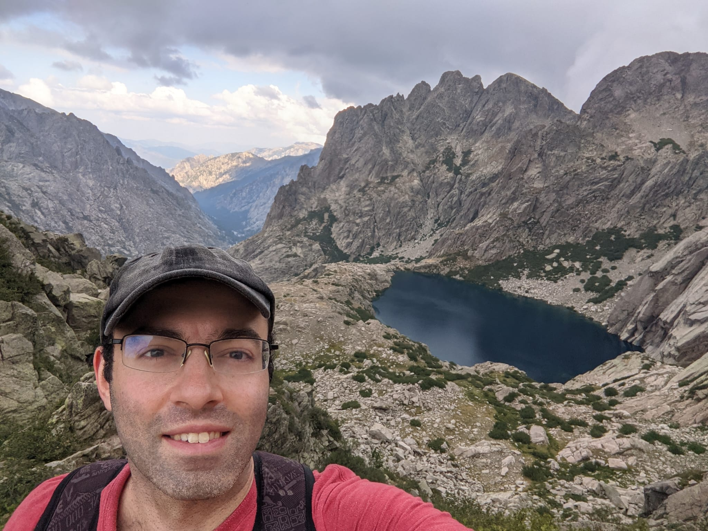

# About me

I am a Research Engineering Team Lead at [DeepMind](http://deepmind.com/) in London,
working on problems related to **Deep Reinforcement Learning**:
exploration, representation learning, offline RL, and more generally
the engineering of large-scale RL agents.

Before that, I completed a PhD in mathematics under the supervision of
[Prof. Sebastian van Strien](http://www2.imperial.ac.uk/~svanstri/) at the University of Warwick.
My PhD research revolved around **Dynamical Systems** in Game Theory, in particular
Fictitious Play Dynamics and related learning processes, and the dynamics of piecewise affine maps and flows.

# Publications

## 2021

## 2019

## 2018

## 2017

## 2016

## 2015

## 2014

## 2013

## 2011

More text.
